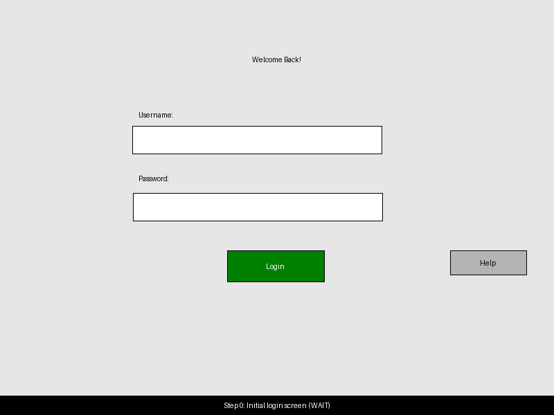
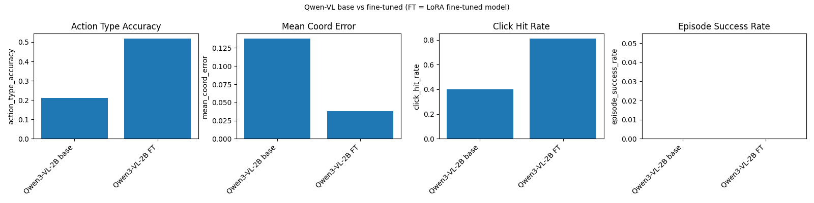
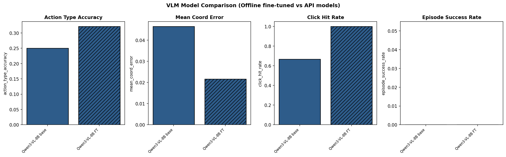
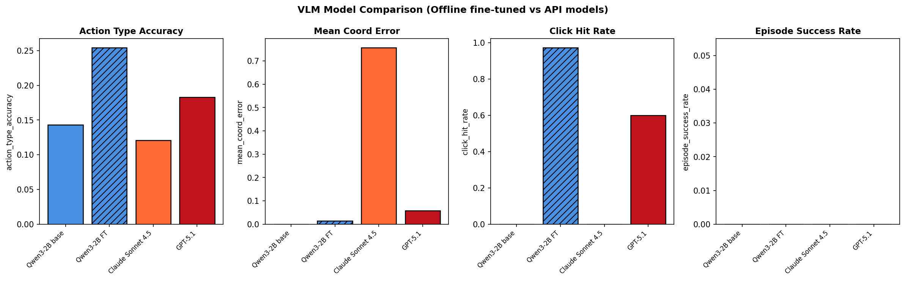

# OpenAdapt-ML

[](https://opensource.org/licenses/MIT)
[](https://www.python.org/)

OpenAdapt-ML is a **model-agnostic, domain-agnostic ML engine** for GUI
automation agents.

It provides:

- **Schemas** for GUI interaction trajectories (screens + actions + goals).
- **Synthetic semantic UI generation** for bootstrapping datasets.
- **Dataset builders** that turn episodes into next-action SFT samples.
- **VLM adapters** (Qwen3-VL, Qwen2.5-VL) using Hugging Face + PEFT.
- A minimal **supervised training loop** for fine-tuning.
- A simple **runtime policy** API that predicts the next GUI action.

The design is described in detail in [`docs/design.md`](docs/design.md).

---

## 1. Quickstart

### 1.1 Install dependencies

From the repository root:

```bash
uv sync
```

### 1.2 Run a small demo policy

Run a fast, model-free smoke test:

```bash
uv run python -m openadapt_ml.scripts.demo_policy --backend dummy
```

### 1.3 Run the synthetic login benchmark (end-to-end)

On a machine with a suitable GPU, you can reproduce the Qwen3-VL synthetic
login benchmark (train → eval base/FT → plot) with a single command:

```bash
uv run python -m openadapt_ml.scripts.run_qwen_login_benchmark \
  --config configs/qwen3vl_synthetic_dev.yaml \
  --out-dir experiments/qwen_login/2b_dev
```

This default invocation will:

- Train a LoRA adapter on the hardened synthetic login scenario.
- Evaluate both the **base** and **fine-tuned** Qwen3-VL models on fresh
  synthetic episodes.
- Write eval JSONs and a comparison plot under
  `experiments/qwen_login/2b_dev/`.

The `qwen3vl_synthetic_dev` config is sized for small development runs on Apple
Silicon / CPU, but will also run on CUDA GPUs.

To additionally compare against hosted API backends (Claude Sonnet 4.5 and
OpenAI GPT-5.1), first install the optional `api` extra and configure your API
keys:

```bash
uv sync --extra api

# Option 1: Use .env file (recommended)
cp .env.example .env
# Edit .env with your API keys

# Option 2: Export environment variables (for CI/containers)
export ANTHROPIC_API_KEY=...  # for Claude Sonnet 4.5
export OPENAI_API_KEY=...     # for GPT-5.1
```

Then run:

```bash
uv run python -m openadapt_ml.scripts.run_qwen_login_benchmark \
  --config configs/qwen3vl_synthetic_dev.yaml \
  --out-dir experiments/qwen_login/2b_dev \
  --include-all-apis
```

This will evaluate and plot **Qwen3 base**, **Qwen3 FT**, **Claude Sonnet 4.5**,
and **GPT-5.1** on the same synthetic login benchmark.

For more details on configs, adapters, and evaluation metrics, see the sections
below and `docs/state_and_next_steps_qwen_login.md`.

---

## 2. Repository Structure

Key modules:

- `openadapt_ml/schemas/`
  - Canonical dataclasses for `Session`, `Episode`, `Step`, `Observation`,
    `Action`.
- `openadapt_ml/ingest/synthetic.py`
  - Synthetic semantic UI generator (e.g. login screen) that produces PNG
    screenshots and scripted episodes.
- `openadapt_ml/datasets/next_action.py`
  - Converts episodes into goal-conditioned, chat-style next-action SFT
    samples suitable for VLM fine-tuning.
- `openadapt_ml/models/base_adapter.py`
  - `BaseVLMAdapter` abstraction shared by all VLM backends.
- `openadapt_ml/models/qwen_vl.py`
  - `QwenVLAdapter` implementing support for **Qwen3-VL** and
    **Qwen2.5-VL**.
- `openadapt_ml/models/dummy_adapter.py`
  - Tiny fake adapter used to validate training and runtime flows without
    loading a real VLM.
- `openadapt_ml/training/trainer.py`
  - Minimal supervised training loop (`train_supervised`) with gradient
    accumulation and logging.
- `openadapt_ml/runtime/policy.py`
  - `AgentPolicy` that formats inputs for a VLM and parses textual actions
    like `CLICK(x=..., y=...)` and `DONE()` into structured `Action`s.
- `openadapt_ml/scripts/train.py`
  - CLI entry point for running synthetic-data training with a chosen
    model/config.
- `openadapt_ml/scripts/demo_policy.py`
  - CLI demo showing how to use `AgentPolicy` with different backends
    (dummy, Qwen3-VL, Qwen2.5-VL).

Configs and docs:

- `configs/qwen3vl_synthetic.yaml`
  - Synthetic training config for **Qwen3-VL-8B-Instruct**.
- `configs/qwen2_5vl_synthetic.yaml`
  - Synthetic training config for **Qwen2.5-VL-7B-Instruct**.
- `docs/design.md`
  - High-level design document (scope, architecture, schemas, adapters,
    training, runtime, and evaluation strategy).

---

## 3. Environment Setup

OpenAdapt-ML targets **Python 3.12** and uses [`uv`](https://github.com/astral-sh/uv)
for dependency management.

### 2.1 Install and sync

From the repository root:

```bash
# Ensure uv is installed (see uv docs for platform-specific install)
# Then:
uv sync
```

This will create a virtual environment (e.g. `.venv/`) and install all
packages declared in `pyproject.toml`.

### 2.2 Working inside the environment

Use `uv run` to execute Python modules and scripts with the synced
environment:

```bash
uv run python -m openadapt_ml.scripts.train --help
```

You can also run `pytest` or other tools via `uv run`.

---

## 4. Synthetic Data & Datasets

The v1 pipeline is validated on **synthetic, semantic UIs**, starting with a
simple login flow.

### 3.1 Synthetic sessions

Synthetic data is generated on the fly by `generate_synthetic_sessions` in
`openadapt_ml/ingest/synthetic.py` and used internally by the training
scripts.

You can also call it directly from Python:

```python
from openadapt_ml.ingest.synthetic import generate_synthetic_sessions

sessions = generate_synthetic_sessions(num_sessions=2, seed=123, output_dir="synthetic_examples")
print(len(sessions), "sessions")
```

Each session contains episodes with:

- A **goal** (e.g. "Log in as demo user").
- A sequence of **steps**, each with:
  - An observation (screenshot path).
  - An action (e.g. `CLICK`, `TYPE`, `DONE`).

### 3.2 Next-action SFT samples

Episodes are converted into SFT-style samples by
`build_next_action_sft_samples` in `openadapt_ml/datasets/next_action.py`.

Each sample has the form:

```python
{
  "images": ["/path/to/screenshot.png"],
  "messages": [
    {"role": "system", "content": ...},
    {"role": "user", "content": "Goal: ...\nCurrent screen: ..."},
    {"role": "assistant", "content": "CLICK(x=..., y=...)"},
  ],
}
```

These samples are wrapped in a simple `NextActionDataset` for use with the
training loop.

For the full, canonical definition of the action DSL (CLICK/TYPE/WAIT/DONE)
and its invariants, see `docs/design.md` §7.4.

---

## 5. Training

Training is driven by `openadapt_ml/scripts/train.py` and YAML configs under
`configs/`.

The training script:

1. Loads a config file (YAML).
2. Generates synthetic sessions.
3. Flattens to episodes and builds SFT samples.
4. Wraps them in a `NextActionDataset`.
5. Instantiates a VLM adapter (e.g. `QwenVLAdapter`).
6. Runs `train_supervised` over the dataset.

### 4.1 Qwen3-VL synthetic training

Config: `configs/qwen3vl_synthetic.yaml`

Key fields:

```yaml
model:
  name: Qwen/Qwen3-VL-8B-Instruct
  load_in_4bit: false  # 4-bit quantization is disabled on macOS / Apple Silicon

# LoRA config and training hyperparameters are also defined in the YAML.
```

Run:

```bash
uv run python -m openadapt_ml.scripts.train --config configs/qwen3vl_synthetic.yaml
```

This will:

- Download and load `Qwen/Qwen3-VL-8B-Instruct`.
- Generate a small synthetic dataset.
- Run a single-epoch supervised fine-tuning loop.
- Print loss values as training progresses.

### 4.2 Qwen2.5-VL synthetic training

Config: `configs/qwen2_5vl_synthetic.yaml`

Key fields:

```yaml
model:
  name: Qwen/Qwen2.5-VL-7B-Instruct
  load_in_4bit: false
```

Run:

```bash
uv run python -m openadapt_ml.scripts.train --config configs/qwen2_5vl_synthetic.yaml
```

This exercises the **Qwen2.5-VL** path in `QwenVLAdapter`, using a
`process_vision_info`-style helper internally to pack image inputs in the
format expected by the Qwen2.5-VL processor.

> Note: Both configs are sized for **small synthetic smoke runs**, not
> large-scale production training.

### 4.3 Qwen3-VL synthetic login benchmark (hero example)

OpenAdapt-ML ships a **synthetic login** benchmark backed by Qwen3-VL,
used to compare **base vs LoRA-fine-tuned** models on a hardened synthetic
environment (layout jitter + a decoy "Help" button).

FT = **LoRA fine-tuned Qwen3-VL** on synthetic login.
Base = **frozen pretrained Qwen3-VL**.

Below is an example hardened 2B login episode, visualized as an animated
GIF. It walks through the full scripted flow (blank screen → clicks →
typing → successful login):



The corresponding hardened comparison plots summarize how the base
vs LoRA-fine-tuned models behave on this benchmark:





**API Comparison:** Qwen3-VL 2B vs Claude Sonnet 4.5 vs GPT-5.1:



For a technical reader, they expose step-level metrics (action type accuracy,
coordinate error, click hit rate). For a non-expert, they visually answer
the question: "Does fine-tuning a small local model outperform large API models?"

Condensed hardened v2 results:

| Model           | action_type_accuracy | mean_coord_error | click_hit_rate |
|----------------|----------------------|------------------|----------------|
| Qwen3-VL-2B    | 0.143                | N/A              | N/A            |
| Qwen3-VL-2B FT | 0.469                | 0.0514           | 0.85           |
| Qwen3-VL-8B    | 0.143                | N/A              | N/A            |
| Qwen3-VL-8B FT | 0.286                | 0.0038           | 1.00           |

API comparison results (Qwen3-VL-2B dev config):

| Model                | action_type_accuracy | mean_coord_error | click_hit_rate |
|---------------------|----------------------|------------------|----------------|
| Qwen3-VL-2B base    | 0.143                | N/A              | N/A            |
| Qwen3-VL-2B FT      | **0.255**            | **0.014**        | **0.974**      |
| Claude Sonnet 4.5   | 0.121                | 0.757            | 0.000          |
| GPT-5.1             | 0.183                | 0.057            | 0.600          |

**Key finding:** The fine-tuned Qwen3-VL-2B significantly outperforms both
Claude Sonnet 4.5 and GPT-5.1 on this domain-specific task, demonstrating
the value of task-specific fine-tuning even with smaller models.

---

## 6. VLM Adapters

All VLM backends implement the shared `BaseVLMAdapter` interface in
`openadapt_ml/models/base_adapter.py` (prepare inputs, compute loss, generate
text from a sample).

Current adapters include:

- `QwenVLAdapter` (`openadapt_ml/models/qwen_vl.py`) for Qwen3-VL and
  Qwen2.5-VL.
- `DummyAdapter` (`openadapt_ml/models/dummy_adapter.py`) for fast smoke
  tests without loading a real VLM.
- `ApiVLMAdapter` (`openadapt_ml/models/api_adapter.py`) for hosted VLM
  APIs (Anthropic Claude Sonnet 4.5 and OpenAI GPT-5.1). This adapter is
  inference-only and implements `generate` using the respective SDKs.

For full adapter internals and training-time vs runtime behavior, see
`docs/design.md` §8.

### 6.1 API-backed adapters

To use the API-backed adapter from Python, you can configure API keys via `.env`
file, environment variables, or pass them explicitly:

```python
from openadapt_ml.models.api_adapter import ApiVLMAdapter

# Use .env file or environment variables (ANTHROPIC_API_KEY / OPENAI_API_KEY)
claude_adapter = ApiVLMAdapter(provider="anthropic")
gpt_adapter = ApiVLMAdapter(provider="openai")

# Or pass API keys explicitly from your application's config
claude_adapter = ApiVLMAdapter(provider="anthropic", api_key="...")
gpt_adapter = ApiVLMAdapter(provider="openai", api_key="...")
```

The existing CLI scripts `scripts/demo_policy.py` and
`scripts/eval_policy.py` expose these backends via the `--backend` flag
(`claude` / `openai`).

---

## 7. Runtime Policy & Demos

The runtime policy is implemented in `openadapt_ml/runtime/policy.py` as
`AgentPolicy`.

### 6.1 AgentPolicy

`AgentPolicy` is initialized with a VLM adapter (dummy or real). Given an
SFT-style sample, it:

1. Calls `adapter.generate(sample)` to obtain assistant text.
2. Parses actions from strings like:
   - `CLICK(x=0.45, y=0.71)`
   - `DONE()`
3. Returns a structured `Action` plus an optional free-form `thought`.

### 6.2 Demo script

`openadapt_ml/scripts/demo_policy.py` demonstrates how to use
`AgentPolicy` with different backends.

Run with a **dummy** backend (fast, no model load):

```bash
uv run python -m openadapt_ml.scripts.demo_policy --backend dummy
```

Run with **Qwen3-VL** backend:

```bash
uv run python -m openadapt_ml.scripts.demo_policy --backend qwen3
```

Run with **Qwen2.5-VL** backend:

```bash
uv run python -m openadapt_ml.scripts.demo_policy --backend qwen2_5
```

Each invocation will:

- Generate a synthetic login episode and select one step.
- Build an SFT-style sample from that step.
- Use `AgentPolicy` to predict the next action.
- Print the raw messages and the parsed action/thought.

---

## 8. Testing

Basic tests are provided under `tests/`.

Run the test suite with:

```bash
uv run pytest
```

In particular:

- `tests/test_training_dummy.py` runs a smoke test over the training loop
  using `DummyAdapter`.

---

## 9. Limitations & Notes

- **Apple Silicon / bitsandbytes**:
  - Example configs are sized for CPU / Apple Silicon development runs; see
    `docs/design.md` §9.4 for details on QLoRA and platform-specific
    considerations.
- **Batching**:
  - For v1, `QwenVLAdapter` is implemented assuming `batch_size=1` for
    simplicity when handling multimodal inputs. The training configs are
    sized accordingly.
- **Evaluation**:
  - v1 focuses on smoke tests and qualitative behavior on synthetic data.
    More formal evaluation scripts and metrics are planned.

For deeper architectural details, see [`docs/design.md`](docs/design.md).

---

## 10. Roadmap

For the up-to-date, prioritized roadmap (including concrete implementation
targets and agent-executable acceptance criteria), see
[`docs/roadmap.md`](docs/roadmap.md).

