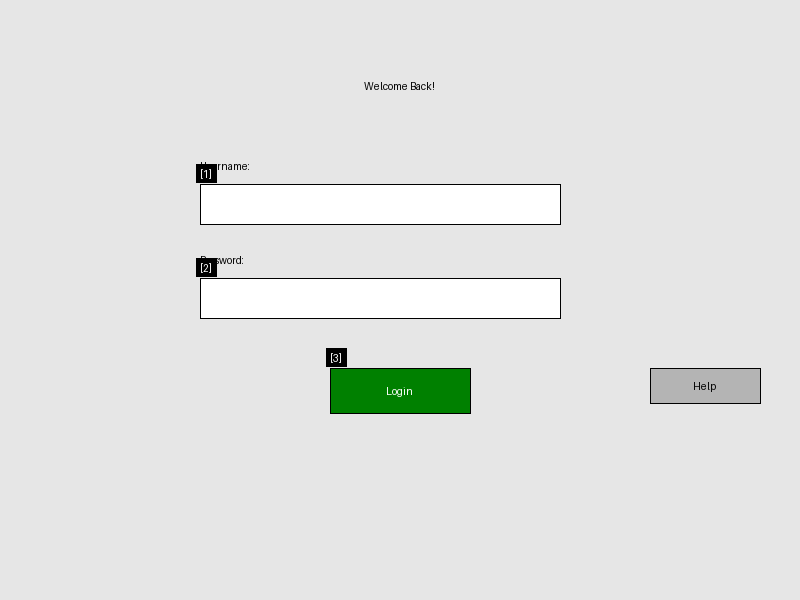
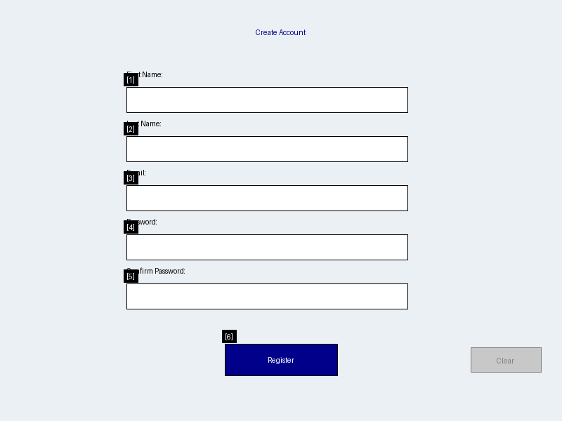

# openadapt-ml

> [!IMPORTANT]
> **Status: Research. Not required by the product.** This package trains and
> runs vision-language model agents for GUI automation. You do not need it to
> record, compile, or replay a workflow. That is
> [openadapt-flow](https://github.com/OpenAdaptAI/openadapt-flow), installed by
> the [OpenAdapt](https://github.com/OpenAdaptAI/OpenAdapt) launcher. Lifecycle
> labels for every repository are in the
> [repository lifecycle registry](https://github.com/OpenAdaptAI/.github/blob/main/REPOSITORY_LIFECYCLE.md).

[](https://github.com/OpenAdaptAI/openadapt-ml/actions/workflows/test.yml)
[](https://pypi.org/project/openadapt-ml/)
[](https://pypi.org/project/openadapt-ml/)
[](LICENSE)

Show a vision-language model a screenshot and a goal, and get back the next GUI
action: click here, type this, stop. This package holds the parts that job
needs, which are a trajectory schema, adapters for Qwen3-VL and the hosted API
models, LoRA fine-tuning, UI grounding, and a policy object you can call from
Python.

It's for people running training experiments. This is research with an unstable
API, and you don't need it to record or replay a workflow. That's
[openadapt-flow](https://github.com/OpenAdaptAI/openadapt-flow), which compiles
a demonstration and replays it with zero model calls.

[Docs](https://docs.openadapt.ai) ·
[Design notes](docs/design.md) ·
[Benchmark writeup](docs/qwen_login_experiment.md) ·
[Repository layout](docs/repo_layout.md)




Qwen3-VL-2B, LoRA fine-tuned on the two synthetic scenarios that ship in
`openadapt_ml/ingest/synthetic.py`. Both scenarios jitter their layout between
episodes, so a model that memorized pixel coordinates fails them.

## Try it

```bash
pip install 'openadapt-ml[training]'
python -m openadapt_ml.scripts.demo_policy --backend dummy
```

The `training` extra isn't optional for this. A plain `pip install openadapt-ml`
gives you the schema and the converters, but no torch, and the dummy adapter
raises `ImportError: torch is required for DummyAdapter` without it.

The smoke test generates one synthetic login episode, builds an SFT-style
sample from it, and runs it through the policy:

```
[user] Goal: Log in with username 'user0' and password 'pass0123'
This is step 1 of 6 (no actions completed yet).

Predicted action: type=<ActionType.DONE: 'done'> coordinates=None text=None ...
Thought: None
Raw output: DONE()
```

Real output from 0.16.3 on macOS. `Action` carries 19 fields and all but three
are cut from that line. `DONE()` is the whole point of the
dummy backend: it returns a fixed action so the run proves the wiring, not the
model. Swap `--backend qwen3` and it downloads Qwen3-VL-8B and predicts for
real.

## Use the policy from Python

```python
from openadapt_ml.datasets.next_action import build_next_action_sft_samples
from openadapt_ml.ingest.synthetic import generate_synthetic_episodes
from openadapt_ml.models.dummy_adapter import DummyAdapter
from openadapt_ml.runtime.policy import AgentPolicy

episodes = generate_synthetic_episodes(num_episodes=1, seed=99, output_dir="synthetic/demo")
sample = build_next_action_sft_samples(episodes)[0]

action, thought, state, raw = AgentPolicy(DummyAdapter()).predict_action_from_sample(sample)
print(action.type, action.coordinates)
print(repr(raw))
```

```
ActionType.DONE None
'DONE()'
```

`predict_action_from_sample` returns a 4-tuple, not an object with attributes.
For a real model, build the adapter with `QwenVLAdapter.from_pretrained(...)`
rather than calling the constructor, which wants an already-loaded model and
processor.

## Record a trajectory

Everything here reads and writes one schema, so a WAA episode, a WebArena
episode, and a recording off your own laptop end up the same shape:

```python
from openadapt_ml.schema import Episode, Step, Action, Observation, ActionType

episode = Episode(
    episode_id="demo_001",
    instruction="Open Notepad and type Hello World",
    steps=[
        Step(
            step_index=0,
            observation=Observation(screenshot_path="step_0.png"),
            action=Action(type=ActionType.CLICK, coordinates={"x": 100, "y": 200}),
        ),
        Step(
            step_index=1,
            observation=Observation(screenshot_path="step_1.png"),
            action=Action(type=ActionType.TYPE, text="Hello World"),
        ),
    ],
    success=True,
)
print(episode.episode_id, len(episode.steps), episode.schema_version)
```

```
demo_001 2 1.0.0
```

## Train

The `--config` paths below are repo-relative, so training needs the checkout
rather than the wheel:

```bash
git clone https://github.com/OpenAdaptAI/openadapt-ml.git
cd openadapt-ml
UV_NO_SOURCES=1 uv sync --extra training
```

```bash
# Synthetic data, no recordings needed
python -m openadapt_ml.scripts.train --config configs/qwen3vl_synthetic.yaml

# Your own recordings, with the training dashboard
python -m openadapt_ml.scripts.train \
  --config configs/qwen3vl_capture.yaml \
  --capture ~/captures/my-workflow --open
```

Training runs on a GPU box you rent by the hour. Lambda Labs, Modal, and
vast.ai each get a one-command training wrapper under `openadapt_ml.cloud`, and
`openadapt_ml.cloud.local` does the same thing against CUDA or Apple Silicon.
The Azure module there is an async inference queue, not a trainer.
The guide is [docs/cloud_gpu_training.md](docs/cloud_gpu_training.md). Unsloth
is separate, see the
[Unsloth install guide](https://docs.unsloth.ai/get-started/installation).

## What the numbers actually say

Coordinate mode on the synthetic login scenario, from
[docs/qwen_login_experiment.md](docs/qwen_login_experiment.md) (December 2025):

| Model | Action accuracy | Coord error | Click hit rate | Episode success |
|---|---|---|---|---|
| Qwen3-VL-2B fine-tuned | 46.9% | 0.051 | 85.0% | 0% |
| Qwen3-VL-8B fine-tuned | 28.6% | 0.004 | 100% | 0% |
| Claude Sonnet 4.5 | 12.1% | 0.757 | 0% | 0% |
| GPT-5.1 | 18.3% | 0.057 | 60.0% | 0% |

Read the last column first. Not one configuration finished a single episode.
Fine-tuning moves individual-step accuracy and it moves click precision, and
neither of those got any model through the login. Switching from coordinates to
Set-of-Marks element ids does finish episodes, on the registration scenario: 32
episodes, 384 steps, 100% on action type, element choice, and episode success,
retained in
[`experiments/qwen_login/registration_som_eval.json`](experiments/qwen_login/registration_som_eval.json).

That's a procedurally generated form with six interactive elements. It shows
the pipeline trains and evaluates end to end. It says nothing about a real
desktop. The hardened login re-runs report different figures again, n=32 under
`experiments/qwen_login/2b_dev/eval/` and n=4 under
`experiments/qwen_login/8b_hero/eval/`, which is about what you'd expect from
samples that small.

## Where this breaks

- **A base VLM can't operate Windows.** Un-fine-tuned models score near-zero
  reward on real GUI tasks, so online RL has nothing to climb. You need an SFT
  checkpoint or a distillation pass before GRPO produces signal at all.
- **`backend="verl"` doesn't train anything.** It prints setup instructions and
  raises `NotImplementedError`. The default `backend="standalone"` is a
  HuggingFace plus PEFT trainer for single-GPU prototyping, and supervised
  fine-tuning through TRL's `SFTTrainer` is the path that gets exercised.
- **The API moves.** Configs, module paths, result formats, and the shape of
  what a function hands back all change between releases, with no deprecation
  window.
- **The benchmarks are synthetic.** Evaluation against WAA and WebArena lives in
  [openadapt-evals](https://github.com/OpenAdaptAI/openadapt-evals), along with
  VM management and the `oa-vm` CLI.

## Contributing

```bash
git clone https://github.com/OpenAdaptAI/openadapt-ml.git
cd openadapt-ml
UV_NO_SOURCES=1 uv sync --extra dev --extra training
uv run pytest
uv run ruff check .
```

Branches and pull requests, never a push straight to `main`. PR titles need
[Conventional Commits](https://www.conventionalcommits.org/) format, because
[Python Semantic Release](https://python-semantic-release.readthedocs.io/)
parses them to pick the next version and publish to PyPI.

## License

[MIT](LICENSE). OpenAdapt is open core, so this repository is permissively
licensed while the hardening corpora, tuned parameters, and deployment-derived
recipes stay out of it.
