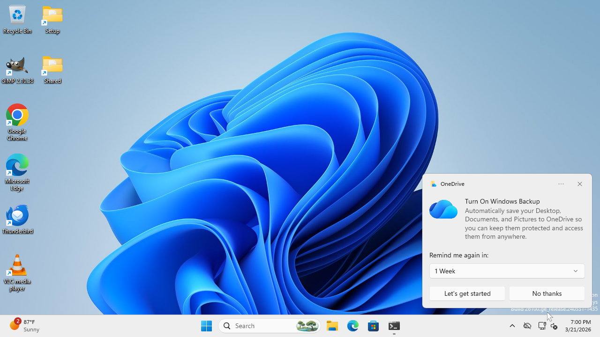
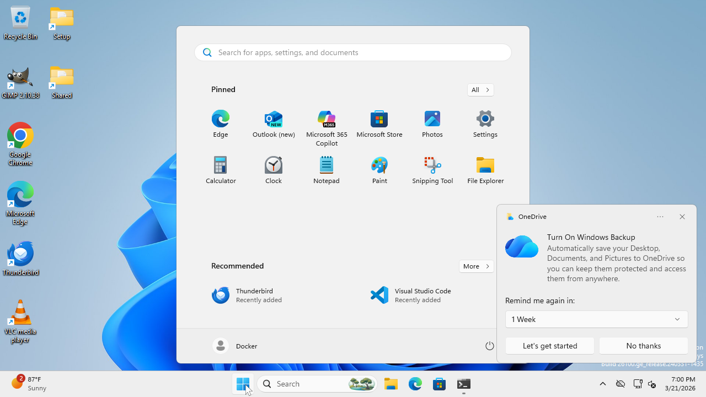
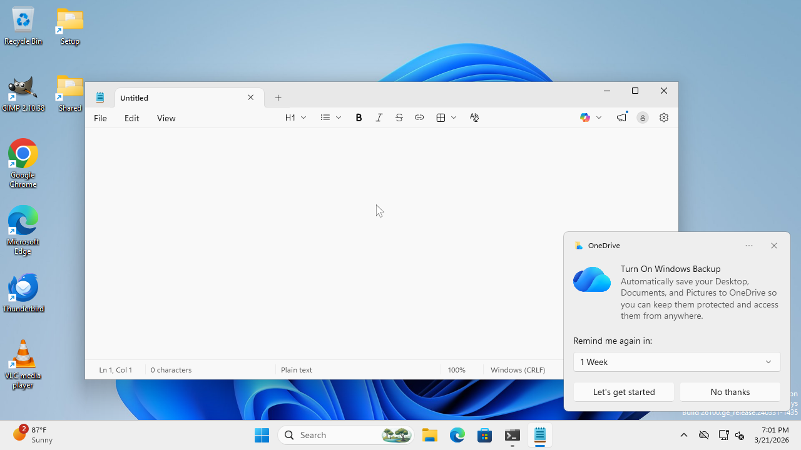

# Trace: Notepad Hello World — Score 0.5 (1/2 milestones)

**Date**: 2026-03-21
**Task**: Open Notepad and type "Hello World"
**Planner**: GPT-5.4-mini (OpenAI)
**Grounder**: GPT-5.4-mini (OpenAI)
**Adapter**: WAALiveAdapter (lightweight=True)
**Steps**: 6
**Time**: 91.0s
**Score**: 0.50 (1/2 milestones)

## Milestones

| # | Milestone | Check | Result |
|---|-----------|-------|--------|
| 1 | Notepad is open | `Get-Process notepad*` via /execute_windows | FAIL (timeout) |
| 2 | Hello World typed | VLM screenshot judge | **PASS** (confidence 1.00) |

## Step-by-step

| Step | Action | Screenshot |
|------|--------|------------|
| 0 | Reset (clean desktop) |  |
| 1 | Click Start button |  |
| 2 | Start menu open, click Notepad |  |
| 3 | Desktop (Notepad loading) |  |
| 4 | Notepad open, type Hello World |  |
| 5 | Hello World typed |  |
| 6 | Done |  |

## What worked
- Lightweight mode: no cleanup crashes, server stayed responsive
- GPT-5.4-mini correctly identified Start → Notepad path
- VLM screenshot evaluation: "PASS (confidence=1.00) — The Notepad window shows the text 'Hello World' clearly in the text area"
- Task instruction emphasis: planner followed "open Notepad" instead of clicking Chrome

## What didn't work
- Milestone 1 (process check): PowerShell `Get-Process notepad*` via /execute_windows timed out
- WAA /evaluate endpoint: unreachable (evaluate_server.py can't connect to Windows VM)
- OneDrive popup appeared but agent worked around it

## Gap vs customer results (score 1.0)
Customer scored 1.0 (2/2 milestones) on same task. Differences:
- They use WAADirect (direct HTTP, no adapter overhead)
- They skip verify_apps/close_all entirely
- They use GPT-5.4 (full, not mini) + UI-Venus grounder (not GPT as grounder)
- Their milestone evaluation runs PowerShell successfully (their /execute_windows is responsive)

Our milestone 1 failed due to /execute_windows timeout during evaluation, not because Notepad wasn't open (screenshot proves it was). The evaluation plumbing is the gap, not the agent behavior.
