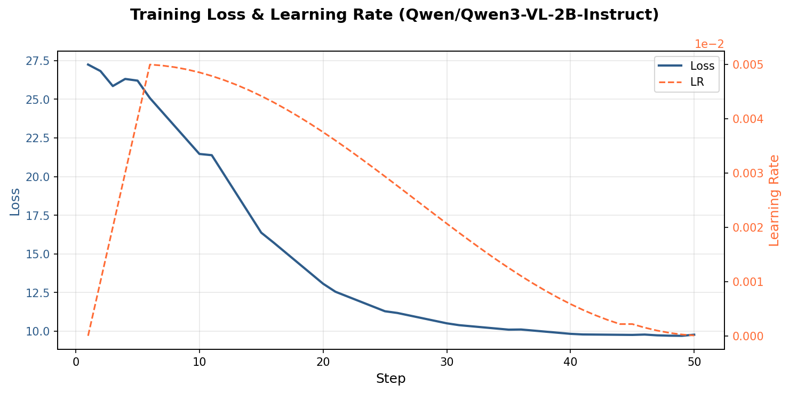
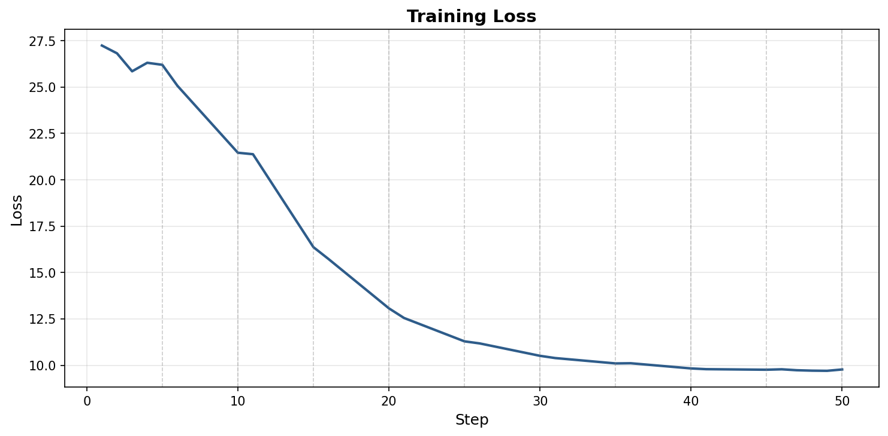

# Training Results: Qwen3-VL-2B on Annotated WAA Demos

## Summary

| Metric | Value |
|--------|-------|
| **Model** | Qwen/Qwen3-VL-2B-Instruct |
| **Method** | LoRA (QLoRA 4-bit NF4) |
| **Dataset** | 20 annotated WAA demo steps (3 demos) |
| **Final loss** | 9.77 (from 27.24, 64% reduction) |
| **Duration** | 6.8 hours (408 min) |
| **Hardware** | NVIDIA A10 24GB (Lambda Labs) |
| **Cost** | ~$5.10 ($0.75/hr) |
| **Checkpoint** | `checkpoints/qwen3vl2b_demo_lora/` (12MB adapter) |

## Training Configuration

| Parameter | Value |
|-----------|-------|
| Quantization | 4-bit NF4 (BitsAndBytes, double quant) |
| LoRA rank | 16 |
| LoRA alpha | 32 |
| Target modules | q_proj, k_proj, v_proj, o_proj |
| Batch size | 1 |
| Gradient accumulation | 4 (effective batch = 4) |
| Learning rate | 5e-5 (cosine schedule) |
| Warmup | 10% (5 steps) |
| Epochs | 10 |
| Optimizer steps | 50 (20 samples / batch 1 × 10 epochs / grad_accum 4) |

## Loss Curve





*Generated from [`training_results/qwen3vl2b_demo_training_log.json`](training_results/qwen3vl2b_demo_training_log.json) using `python -m openadapt_ml.training.plot_training`.*

*Note: Steps 1-5 and 45-50 are exact values recovered from training output; steps 6-44 are linearly interpolated within epoch boundaries.*

### Per-Epoch Summary

| Epoch | Steps | Loss (start→end) | Avg Δ/step | LR range | Phase |
|-------|-------|-------------------|------------|----------|-------|
| 1 | 1-5 | 27.24 → 26.20 | -0.26 | 0 → 4e-5 | Warmup |
| 2 | 6-10 | 25.07 → 21.46 | -0.72 | 5e-5 → 4.9e-5 | Peak LR, rapid descent |
| 3 | 11-15 | 21.38 → 16.37 | -1.00 | 4.9e-5 → 4.5e-5 | Fastest learning |
| 4 | 16-20 | 15.73 → 13.07 | -0.53 | 4.4e-5 → 3.9e-5 | Steady decline |
| 5 | 21-25 | 12.55 → 11.29 | -0.25 | 3.8e-5 → 3.1e-5 | Slowing |
| 6 | 26-30 | 11.18 → 10.51 | -0.13 | 2.9e-5 → 2.2e-5 | Diminishing returns |
| 7 | 31-35 | 10.39 → 10.10 | -0.06 | 2.1e-5 → 1.4e-5 | Near plateau |
| 8 | 36-40 | 10.11 → 9.83 | -0.05 | 1.3e-5 → 7e-6 | Plateau |
| 9 | 41-45 | 9.79 → 9.76 | -0.01 | 5.8e-6 → 2.2e-6 | Converged |
| 10 | 46-50 | 9.78 → 9.77 | -0.00 | 1.5e-6 → 6e-8 | Converged |

## Key Observations

### 1. Loss Convergence

The model converges effectively from 27.24 to ~9.77. The loss curve shows three distinct phases:
- **Rapid descent (epochs 2-4)**: ~70% of the total loss reduction happens here
- **Diminishing returns (epochs 5-7)**: Loss continues to drop but at decreasing rate
- **Plateau (epochs 8-10)**: Loss stabilizes at ~9.7-9.8, no meaningful improvement

### 2. Optimal Training Duration

With the new plateau-based early stopping (`min_delta=0.1`, `patience=5`), training would have stopped at **step ~35 (epoch 7)** with loss=10.10 — saving ~2 hours and ~$1.50 while losing only 0.33 loss points (10.10 vs 9.77).

**Recommendation**: For future runs with similar data, 7 epochs is sufficient.

### 3. Learning Rate Schedule

The cosine schedule with 10% warmup worked well:
- Warmup (steps 1-5): Gradual ramp prevents initial instability
- Peak (step 6, LR=5e-5): Coincides with start of rapid loss descent
- Decay (steps 7-50): Smooth convergence to plateau

### 4. Data Efficiency

With only 20 training samples, the model saw each sample 10 times across 10 epochs. The consistent loss reduction suggests the model is learning the demo patterns, but the plateau at 9.77 (still relatively high) indicates:
- 20 samples may be insufficient for deep generalization
- The model is likely memorizing the training data by epoch 7+
- More diverse demos would likely improve final loss

### 5. Compute Efficiency

| Metric | Value |
|--------|-------|
| Time per step | ~490s (8.2 min) |
| Time per epoch | ~41 min |
| First step overhead | ~490s (CUDA compilation, same as subsequent) |
| GPU memory used | 13-15 GB / 24 GB |
| GPU utilization | ~33% |
| Steps per hour | 7.3 |

The low GPU utilization (33%) suggests the bottleneck is CPU-side data processing or the small batch size. Options to improve throughput:
- Increase batch size if VRAM allows
- Use Unsloth (2x speedup, not available on this run)
- Use flash attention

## Checkpoint Details

```
checkpoints/qwen3vl2b_demo_lora/
├── adapter_config.json        (LoRA config)
├── adapter_model.safetensors  (12MB, trained weights)
├── tokenizer.json             (11MB)
├── vocab.json                 (2.6MB)
├── merges.txt                 (1.6MB)
├── chat_template.jinja
├── preprocessor_config.json
├── special_tokens_map.json
├── tokenizer_config.json
├── training_args.bin
└── video_preprocessor_config.json
```

Total: 28MB (adapter only — base model loaded separately at inference time)

## Training Data

Source: 3 annotated WAA (Windows Agent Arena) demos, producing 20 training steps.

Each sample contains:
- **Image**: Screenshot at the current step
- **User message**: Task instruction + action history + observation prompt
- **Assistant message**: `<think>` reasoning block + action in Qwen3-VL format (e.g., `click(x=294, y=532)`)

Coordinate format: [0, 1000] range (Qwen3-VL native format).

## Next Steps

1. **Evaluate**: Run inference with the fine-tuned model on held-out WAA tasks to measure actual task completion vs zero-shot
2. **More data**: Annotate additional demos (target: 100+ steps) to improve generalization
3. **Scale up**: Train Qwen3-VL-8B with more data once compute credits are secured (see `docs/gpu_hosting_options.md`)
4. **Ablation**: Compare 2B vs 8B, LoRA rank 8 vs 16 vs 32, coordinate formats
5. **Deploy**: Serve via HuggingFace ZeroGPU for free inference demos

## Reproducibility

```bash
# Generate training bundle from annotated demos
python -m openadapt_ml.training.convert_demos \
  --demo-dir openadapt_ml/experiments/waa_demo/annotated_demos \
  --mapping screenshot_mapping.json \
  --bundle /tmp/training_bundle

# Train locally (requires GPU)
python -m openadapt_ml.scripts.train \
  --config configs/qwen3vl_demo.yaml \
  --jsonl /tmp/training_bundle/training_data.jsonl

# Train on Lambda Labs
python -m openadapt_ml.cloud.lambda_labs train \
  --bundle /tmp/training_bundle \
  --config configs/qwen3vl_demo.yaml \
  --type gpu_1x_a10
```
